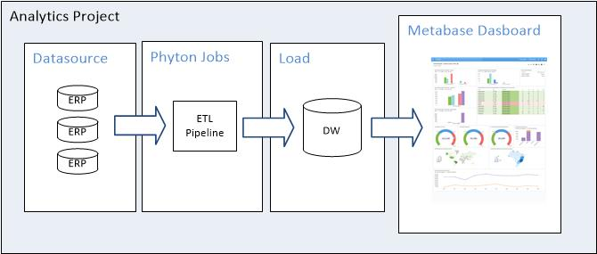
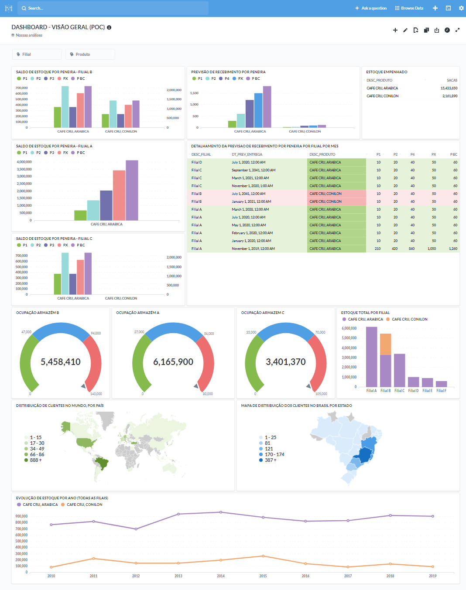

# Metabase Analytics com Python
Analytics

## Motivação
Falta de uma visão global das diversas áreas de negócio da companhia, o que dificulta qualquer tipo de tomada de decisão estratégica

## Desafio
* Banco de dados origem sem qualquer tipo de mecanismo de otimização devido as caracterísca do ERP;
* 150.000+ linhas de dados bruto;
* Tipos de dados básicos (char e number) para todas as colunas de todas as tabelas do ERP;
* Desejável que se tenha o menor 'gap' possível entre os pipelines.
 
## Abordagem
Desenvolver ETL's que busque dados no ERP em produção, trate/transforme o dado bruto em informação útil e as transporte para um banco de dados exclusivo e otimizado para a criação de dashboards de negócio

1. Modelagem e construção de uma estrutura de banco de dados otimizado para DW;
2. Carga de dados do ERP de Produção;
3. Tratamento e Transformação dos dados;
4. Carga das informações para o banco DW;
5. Criação de dashboards de negócio.

## Solução
1. Modelagem de estruturas de tabela otimizadas em um novo schema de banco de dados Oracle de forma a suportar a carga e a performance exigida por uma solução de analytics
	- SQL
	- Oracle
	- Modelagem

2. Desenvolvimentos de ETL's em Python que conectam ao schema do banco de dados Oracle do ERP de produção e fazem todo o tratamento e conversão dos diversos tipos de dados para carga em um outro schema de banco de dados também em Oracle otimizado para trazer uma performance satisfatória
	- Python
	- Oracle
	- SQL

3. Desenvolvimento de dashboard sob a plataforma Metabase que aborda diversas métricas de negócio utilizando filtros dinâmicos para refinar as visualizações 
	- SQL
	- Metabase
	
## Estruturação da Solução

	

## Resultado
A área de negócio passa a ter uma visão global, precisa e dinâmica de varios indicadores de negócio que interagem entre sí, tais como: Posição de Compras, Previsão de Recebimento, Previsão de Vendas, Indicadores de Estoque, etc., desta forma é possível tomar decisões estratégicas de forma a garantir que a companhia seja cada vez mais competitiva e eficiente

	

** Por questões de privacidade este dashboard está baseado em dados fictícios **

